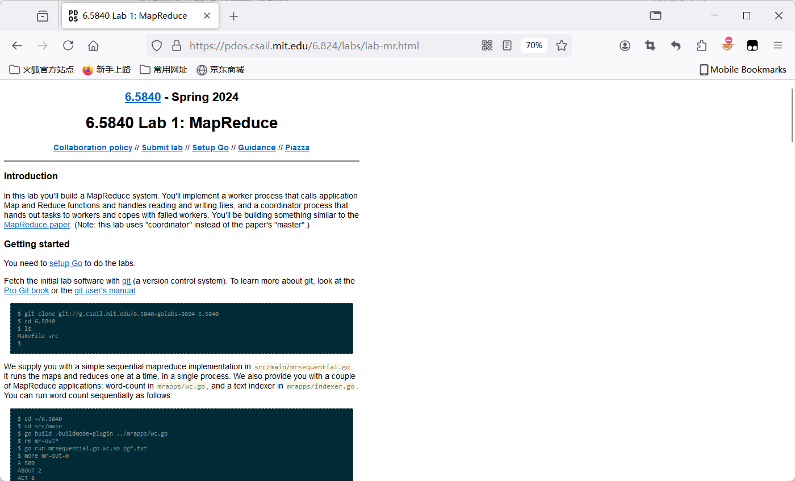

重生之我要学习分布式系列第一篇。

课程主页：

[6.5840 Schedule: Spring 2024](https://pdos.csail.mit.edu/6.824/schedule.html)

明星课程MIT 6.5840: Distributed Systems，原名6.824，在2024年一共布置了5个lab。这几个lab循序渐进，从古法分布式MapReduce搓起，然后手搓raft，并最终造出类似TiKV的分布式数据库，整个过程做下来真有种开局一根针手搓Windows的爽感。

# 如何防治劲椎病
就像某国产3A大作的九九八十一难的第一难是解压游戏，本课程的第一难是让人憋出劲椎病的文档网页。




由于文档弹道偏左，考虑在控制台里把它水平居中。

```javascript
const body = document.body;
body.style.maxWidth = "800px";
body.style.marginLeft = "auto";
body.style.marginRight = "auto";
const elements = body.getElementsByTagName("*");
for (let i = 0; i < elements.length; i++) {
    elements[i].style.maxWidth = "100%";
    elements[i].style.boxSizing = "border-box";
}
```

# lab内容简单介绍
lab1是比较独立的开胃小菜，要实现一个Google曾经使用的MapReduce框架。

lab2实现一个简单的单体KV服务器，要求在网络不稳定的情况下也能保证服务不出错。

lab3则是实现Raft协议。

lab4要基于lab3实现的Raft协议，构建一个KV服务器集群，也就是在lab2的基础上用Raft协议保证Fault-tolerant。

lab5则要在lab4的基础上，把数据库的数据分为几个分片（shard）来减轻单个服务器负担，需要实现他们的数据迁移。

个人认为最难实现的两个lab显然是lab3和lab5。lab3需要对Raft的原始论文仔细研读，lab5则需要一开始就设计好整个架构如何实现，辅以网上搜索相关的实现思路才好开始上手。

# Debug小技巧
个人认为实现这些lab最有挑战性的地方不是在设计或者编写上，而是debug上。因为传统的打断点debug方法是对一个单体应用操作，而本次lab需要面对的是一个集群系统，打断点的方法就很难操作，所以主要还是靠print大法。那么设计一个好的打印函数非常有必要，例如可以把打印函数抽象出来。例如lab5我用了这样一个函数对println包装

```go
func (kv *ShardKV) SSPrintf(format string, a ...interface{}) (n int, err error) {
	if SDebug {
		log.Printf("[server %d]"+format, append([]interface{}{kv.gid}, a...)...)
	}
	return
}
```

kv.gid是标识ShardKV的相关信息之一，实践上还可以塞入更多的基本信息，当然这可能要考虑获取这些信息会不会造成读写上的条件竞争的问题。

本次实验我只用了SDebug来判断是否打印日志，但实际上可以设计一个类似level的东西，来方便区分重要日志和不那么重要的日志。

在需要分析Bug日志的时候，可以借助Linux的tee命令让日志同时输出到stdout和文件里。

```bash
go test -race -run TestConcurrent3_5B | tee bug.txt
```

在需要输出日志的地方可以多加几个条件判断，确认是bug可能发生的那种条件，这样可以减少大量无意义的日志。

# 代码仓库
[KingBridgeSS/MIT-6.5840: My solution for labs in MIT-6.5840 (https://pdos.csail.mit.edu/6.824/)](https://github.com/KingBridgeSS/MIT-6.5840)

