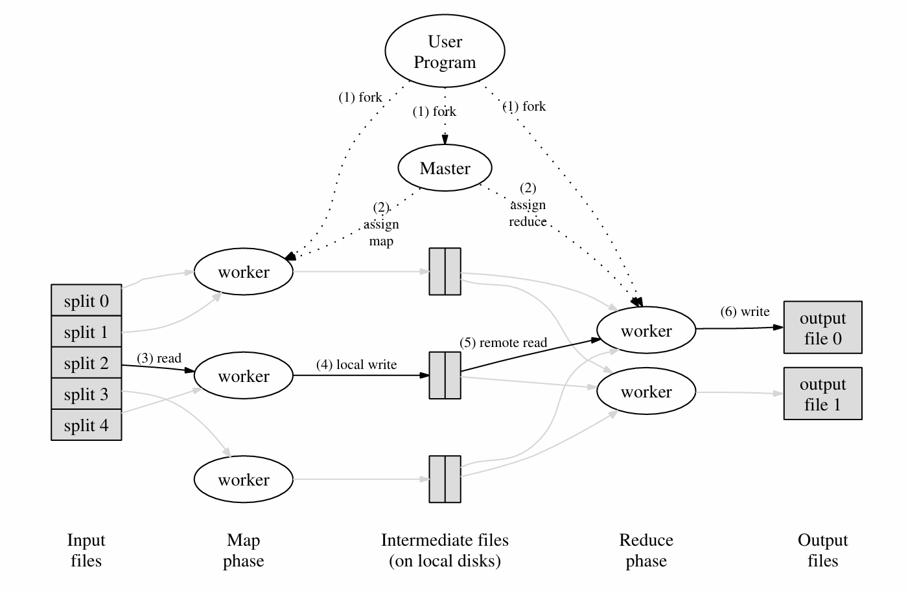

# 理论

MapReduce主要用来解决大规模数据处理的问题，它能够将一个计算任务分解为许多小任务，这些小任务可以在多台机器上并行执行，从而大大提高处理速度和效率。

它的核心思想参考Google论文中的图片



Master程序是主要的程序，它会将文件（N个）分配个worker，所有worker是对等的。worker将会首先执行Map命令，接受一些文件，然后输出为键值对并写入R个（用户可以自定义R的值）中间文件（图中的Intermediate files）。**当所有Map任务完成后**，Master会给worker分配Reduce任务，对中间文件进行处理，然后生成最终的结果文件。

其中，Map函数和Reduce函数可以以插件的形式提供给系统。

例如，在Words Count场景下（统计若干文件里每个相同单词的数量）：

```plain
map(String key, String value):
    // key: document name
    // value: document contents
    for each word w in value:
        EmitIntermediate(w, "1");
reduce(String key, Iterator values):
    // key: a word
    // values: a list of counts
    int result = 0;
    for each v in values:
        result += ParseInt(v);
    Emit(AsString(result));
```

这个例子中，map函数将生成一系列key为word，value为"1"的中间文件，然后reduce将同一个key聚合，统计value的数量。

这样我们就实现了数据集的分布式处理。

# 代码
系统的启动流程如下：

+ 运行<font style="color:#080808;background-color:#ffffff;">mrcoordinator</font>
+ <font style="color:#080808;background-color:#ffffff;">运行若干个mrworker</font>
+ <font style="color:#080808;background-color:#ffffff;">mrcoordinator调用coordinator，并定期检查coordinator完成情况</font>
+ <font style="color:#080808;background-color:#ffffff;">mrworker加载map和reduce函数，并拉起worker进程</font>

<font style="color:#080808;background-color:#ffffff;">其中coordinator和worker之间使用rpc通信，我们只需要实现coordinator和worker的逻辑。</font>

## <font style="color:#080808;background-color:#ffffff;">Coordinator</font>
几个要点：

+ 考虑维护task的状态，而不需要维护worker的状态，因为worker实际上是对等的。
+ Coordinator是多线程的，需要加锁。由于不需要各线程通信，这里选用Mutex
+ 两个rpc关键函数：<font style="color:#080808;background-color:#ffffff;">FetchTask和FinishTask，一个用来给worker查找任务，一个用来标记任务结束</font>

关键结构体如下：

```go
type Coordinator struct {
	// Your definitions here.
	lock               sync.Mutex
	files              []string
	mapTaskStatuses    []int
	reduceTaskStatuses []int
	nMap               int
	nReduce            int
	mapDoneNum         int // map任务完成数量
	reduceDoneNum      int
	mapFinished        bool
	reduceFinished     bool
}
```

两个rpc函数主要逻辑：

```go

func (c *Coordinator) FetchTask(args *FetchTaskArgs, reply *FetchTaskReply) error {
	c.lock.Lock()
	defer c.lock.Unlock()
	if !c.mapFinished {
		mapNum := xxx // 循环mapTaskStatuses找到未开始的任务
		if mapTaskStatuses全都分配了 {
			reply.TaskType = NOTASK
		} else {
            // 分配任务
			// 10s不完成任务就错误恢复
		}
	} else if !c.reduceFinished {
            // 和map类似
		}
	} else {
		reply.TaskType = NOTASK
	}
	return nil
}
func (c *Coordinator) FinishTask(args *FinishTaskArgs, reply *FinishTaskReply) error {
	c.lock.Lock()
	defer c.lock.Unlock()
	switch args.TaskType {
	case MAPTASK:
		{
			// 由于错误恢复机制，这里可能提交同样的任务。仅接受第一个提交的任务即可
			if c.mapTaskStatuses[args.TaskNum] != DONE {
				c.mapDoneNum += 1
				c.mapTaskStatuses[args.TaskNum] = DONE
				if c.mapDoneNum == c.nMap {
					c.mapFinished = true
				}
			}
		}
	case REDUCETASK:
        // 和上面类似
	}
	return nil
}
```

## Worker
worker主要是业务逻辑。大体框架如下：

```go
func Worker(mapf func(string, string) []KeyValue,
	reducef func(string, []string) string) {
	for {
		reply := &FetchTaskReply{}
		ok := call("Coordinator.FetchTask", &FetchTaskArgs{}, &reply)
		if ok {
			switch reply.TaskType {
			case MAPTASK:
				{
                    // 根据reply指定的filename调用map处理，并输出中间文件
                    // rpc FinishTask
				}
			case REDUCETASK:
				{
                    // 根据reply的ReduceNum读取中间文件（多个），输出为一个结果文件
                    mp := make(map[string][]string)
                    // 聚合
                    // reduce
                    // rpc FinishTask
				}
			case NOTASK:
				{
					break
				}
			}
		} else {
			break
		}

	}
}
```

一些细节需要注意：

+ 中间文件名为<font style="color:#080808;background-color:#ffffff;">mr-X-Y，X是MapNum（即map任务编号），Y是map函数生成的key到[0, NReduce)整数集的单射，具体而言是通过如下哈希函数计算的：</font>

```go
func ihash(key string) int {
	h := fnv.New32a()
	h.Write([]byte(key))
	return int(h.Sum32() & 0x7fffffff)
}
```

+ 每一个reduce函数需要处理一个Y对应的所有X
+ 由于reduce的输入是一个key和它对应的所有values，所以需要对中间文件进行聚合。这里使用的是HashMap。<font style="color:rgb(31, 35, 40);">在生产级别的MapReduce实现中，该部分需要内存+外存来保证不会OOM。</font>
+ <font style="color:rgb(31, 35, 40);">为了保证创建并写入文件的原子性（要么完全写入，要么完全不写入），可以先创建临时文件，再写入，再重命名：</font>

```go
func writeStringToFileAtomic(filename string, content string) {
	f, _ := os.CreateTemp(".", filename+"*")
	f.WriteString(content)
	os.Rename(f.Name(), filename)
	f.Close()
}
```

+ reduce最后生成的文件内容需要不断拼接结果字符串，应该使用StringBuilder来获得更好的性能

```go
var result strings.Builder
for key, values := range mp {
    reduceResult := reducef(key, values)
    result.WriteString(fmt.Sprintf("%v %v\n", key, reduceResult))
}
// 获得字符串：result.String()
```

# 拓展
重读Google的论文可以发现Google用于生产环境的MapReduce相比于我们上面实现的lab还有几个改进：

+ <font style="color:rgb(0, 0, 0);">当worker运行在多个机器上时，需要使用一些分布式文件系统方案来管理文件，例如GFS</font>
+ <font style="color:rgb(0, 0, 0);">reduce生成的文件可能会被用于下一个MapReduce任务，从而形成某种链子</font>
+ <font style="color:rgb(0, 0, 0);">在实际实现中，还是需要维护Worker的状态，这样可以便于获取Worker机器的信息、错误恢复等</font>
+ <font style="color:rgb(0, 0, 0);">实际使用中，Google发现当一些机器在即将处理完Map或Reduce任务时，性能会出现明显的下降。解决方法是Master在组任务即将完成时会分配剩下的任务作为Backup Tasks，分配到其他worker上，以最快完成的任务为最终结果。  </font>

<font style="color:rgb(0, 0, 0);">Google也提出了一些改进思路</font>

+ <font style="color:rgb(0, 0, 0);">Partitioning Function：上面把key映射的hash函数是可以自定义的，叫做Partitioning Function。例如key是URL的时候可以把同一个Host分到同一个Reduce任务里</font>
+ <font style="color:rgb(0, 0, 0);">Ordering Guarantees：在同一个partition里可以先做key的排序处理，这样可以使得结果更为友好</font>
+ <font style="color:rgb(0, 0, 0);">Combiner Function：注意到上面Words Count例子中，大量的类似(word,"1")会在网络上传输，而根据key聚合values发生在reduce函数中。如果把聚合操作写在map函数里则可以避免这些重复的数据传输。combiner function和reduce function的唯一区别是前者输出中间文件，后者输出最终文件。</font>
+ <font style="color:rgb(0, 0, 0);"> Input and Output Types：Google提供了reader接口，使得用户在实现Map函数的时候可以读取更多的Input Types，例如数据库里的数据或内存里的数据。Output同理。</font>
+ <font style="color:rgb(0, 0, 0);">master可以维护一个HTTP panel显示各个worker、task等的状态</font>
+ <font style="color:rgb(0, 0, 0);">Counter：可以在map函数调用自定义的counter，持续返回给master。者可以用于收集一些数据的信息，例如Words Count例子中</font>

```go
Counter* uppercase;
uppercase = GetCounter("uppercase");

map(String name, String contents):
    for each word w in contents:
        if (IsCapitalized(w)):
            uppercase->Increment();
        EmitIntermediate(w, "1");
```

最后，2024年的今天MapReduce对于Google来说早已经成为了历史。但是它催生出了Hadoop等开源大数据处理框架。
