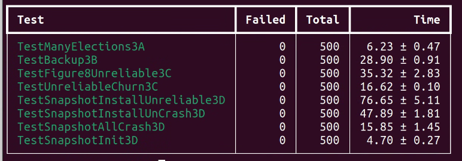

由于Lab2是一个KV数据库，和Lab3、Lab4比较相关，所以之后的文章会把他们放在一起。这篇文章先介绍Lab3。

# Raft算法概览资料

可以去这个网站可视化地理解Raft算法

[Raft (thesecretlivesofdata.com)](https://thesecretlivesofdata.com/raft/#home)

算法实现的所有细节在raft-extended论文中都有清晰的阐述，这里不再赘述。重点关注figure 2的实现逻辑

[pdos.csail.mit.edu/6.824/papers/raft-extended.pdf](https://pdos.csail.mit.edu/6.824/papers/raft-extended.pdf)

# 3A: Leader Election
为了实现Leader Election，事实上我们就要实现Raft中最核心的两个timing了。我把ElectionTimeout和broadcastTime分别用electionTickerHandler和broadcastTickerHandler封装，他们用Ticker来控制（尽管课程建议不要用Ticker，但其实也不难实现）

```go
func (rf *Raft) Ticker() {
	for rf.killed() == false {
		select {
		case <-rf.electionTimer.C:
			{
				rf.electionTickerHandler()// 这个函数会reset timer，下同
			}
		case <-rf.broadcastTimer.C:
			{
				rf.broadcastTickerHandler()
			}
		}
	}
}
// reset timer
func (rf *Raft) resetElectionTimeout() {
	resetTimer(rf.electionTimer, rf.getElectionTimeout())
}
func (rf *Raft) resetBroadcastTimeout() {
	resetTimer(rf.broadcastTimer, time.Duration(broadcastTimeout)*time.Millisecond)
}
func resetTimer(timer *time.Timer, d time.Duration) {
	if !timer.Stop() {
		select {
		case <-timer.C:
		default:
		}
	}
	timer.Reset(d)
}
// 初始化：
rf.electionTimer = time.NewTimer(rf.getElectionTimeout())
rf.broadcastTimer = time.NewTimer(time.Duration(broadcastTimeout) * time.Millisecond)
```

electionTickerHandler根据当前state的状态决定是否要发起竞选

```go
func (rf *Raft) electionTickerHandler() {
	rf.mu.Lock()
	switch rf.state {
	case FOLLOWER:
		{
			go rf.campaign()
		}
	case CANDIDATE:
		{
			go rf.campaign()
		}
	case LEADER:
		{
			// do nothing
		}
	}
	rf.resetElectionTimeout()
	rf.mu.Unlock()
}
```

campaign函数用于发起竞选，遍历peer向他们发送对应的RequestVoteRPC。发送RequestVoteRPC的过程一定要异步发送（使用go 协程）。

由于是异步发送，在接受选票的时候可以用go channel。注意接受选票前要把大锁释放了。

```go
for peerIndex := range rf.peers {
    if peerIndex != rf.me {
        // 异步发送这些请求
        go rf.sendRequestVote(peerIndex, &reqArgs, replyCh)
    }
}
nVotes := 0 //收到的选票
target := rf.majority()
term := rf.currentTerm
rf.mu.Unlock()
for reply := range replyCh { // 从管道接受选票
    if reply.Ok {
        if reply.VoteGranted {
            nVotes += 1
            if nVotes >= target {
                rf.seizePower(term)
                break
            }
        } else if reply.Term > term {
            // ...
            break
        }
    }
}
```

我把leader上任的函数封装成了seizePower函数，目前仅用于转换state，后续会用来做很多其他事情。这里有一个非常重要的判断：seizePower需要判断当前term是否和当时竞选的term一致，否则就有可能导致两个leader同时在一个term内出现（split brain）。

RequestVote的实现较为简单，直接将论文中的文字翻译一下即可。

broadcastTickerHandler在下文中将详细叙述，在3A中只要发送心跳包即可。

# 3B: Log Replication
在实现这一部分前，可以先看看TiKV对Simple Request Flow的优化

[TiKV 功能介绍 - Raft 的优化 | PingCAP](https://cn.pingcap.com/blog/optimizing-raft-in-tikv/)

这里非常精妙的一点就是Asynchronous Apply，即使用一个单独的进程，根据lastApplied和commitIndex的关系专门用于apply command。

我把这一个进程成为commitChecker，它会不断循环运行。当检测到commitIndex改变时，就进行apply。这可以用sync.Cond进行同步来减少无效循环。有两种时机会更新commitIndex：

+ follower在appendEntriesRPC时更新commitIndex
+ leader检查matchIndex发现某个Index被大多数节点接受了

另外，通过applyCh向上层apply可能是一个耗时操作，此时最好不要使用锁。

```go
func (rf *Raft) commitChecker() {
	for !rf.killed() {
		rf.mu.Lock()
		for rf.commitIndex <= rf.lastApplied {
			rf.commitCheckerCond.Wait()
		}
		// commit的范围： [lastApplied+1,commitIndex]
		entries := rf.log[rf.lastApplied+1 : rf.commitIndex+1]
		rf.mu.Unlock()
		for i, entry := range entries {
			msg := ...
			rf.applyCh <- msg
		}
		rf.mu.Lock()
		rf.lastApplied = max(commitIndex, rf.lastApplied)
		rf.mu.Unlock()
	}
}
```

前面提到，broadcastTickerHandler用于leader发送最新的日志，follower用AppendEntries接受。这里的实现细节在figure 2中有详细叙述，翻译成代码即可。值得一提的是，论文中对于 Receiver implementation 处理 entry conflicts 并更新log的部分比较冗长，这里的等价实现比较简单。

```go
if args.PrevLogIndex+len(args.Entries) > len(rf.log)-1 {
    rf.log = append(rf.log[:args.PrevLogIndex+1], args.Entries...)
}
```

等价的原因来源于paper中的figure 3的数学归纳推论：

> Log Matching: if two logs contain an entry with the same index and term, then the logs are identical in all entries up through the given index. §5.3
>

当然这里涉及到GC回收原始数组的问题（后面的优化会提到），更好的写法是：

```go
newLog := make([]LogEntry, args.PrevLogIndex+1+len(args.Entries))
copy(newLog, rf.log[:args.PrevLogIndex+1])
copy(newLog[args.PrevLogIndex+1:], args.Entries)
rf.log = newLog
```

另外，这里的appendEntriesRPC和心跳包用的是同一个timer，符合论文里提到的包文复用原理。

最后，leader需要不断统计matchIndex的情况以更新自己的commitIndex。

> If there exists an N such that N > commitIndex, a majorityof matchIndex[i] ≥ N, and log[N].term == currentTerm:
>
> set commitIndex = N
>

这里也是为leader独立出来了一个不断运行的leaderUpdateCommitIndexChecker来更新commitIndex。

# 3C: Persistence 
原理上来说把论文里的几个 Persistent State 写好就行，注意每次这几个state的时候都要persist一遍。

这里有一个很值得思考的问题：commitIndex和lastApplied要不要持久化？

以下这段话摘自

[niebayes/MIT-6.5840: My solution for MIT 6.5840 (aka. MIT 6.824). No failure within 30,000 tests. (github.com)](https://github.com/niebayes/MIT-6.5840)

> 首先要说明的是，以下的讨论建立在 log entries 被 persist 的基础上。
>
> 对于 committed index，没有必要 persist 它。对于 leader，它通过 broadcast append entries 或者 heartbeat，可以知道每个 followers 的 match index。再通过 majority 的 min match index，即可知道当前集群的 committed index。对于 follower，通过 leader 发送过来的 committed index，就可以知道 committed index。
>
> 但是显然，由于 log entries 被 persist 了，那么再 persist committed index，是很直接的一个行为。如果 persist 了，自然可以省去不少麻烦。所以，很多 raft 的实现都会 persist committed index，我也是这样设计的。
>
> 对于 applied index，我们需要考虑 server 层的实现。实际上，raft 层所存储的 applied index 通常是滞后于 server 层的 applied index。raft 层与 server 层大概是这样交互的：
>
> 某个 raft peer 检测到某个 committed log entry 还没有被 server 所 apply（通过比对 raft 层维护的 committed index 与 applied index），那么它就会把这个 log entry 传输给 server 层。
>
> server 层收到之后，会检查这个 log entry 是否真的尚未被 apply。
>
> 如果是，那么这个 log entry 可能会被立即 apply，也可能会被buffer 在 server 层，待之前的所有 log entries 都被 apply 了之后，再 apply 这个 log entry。
>
> 如果已经被 apply 了，那么直接 discard 这个 log entry。
>
> 每当 server apply 了一个 log entry 后，server 层会通知 raft 层自己已经 apply 到了这个 log entry，此时 raft 层才会更新 applied index。
>
> 有些设计会让 server 批量 apply 一些 log entries，然后再通知 raft 层，而不是 apply 一个就通知一次。
>
> 那么 applied index 到底要不要 persist 呢？这就要看 server 层的 state machine 的 persist 设计了。
>
> 如果 state machine 没有 persist 机制，那么 restart 时就需要 replay raft log entries，则 raft 层不能 persist applied index。如果 persist 了，那么 raft 层会错误地认为 server 层已经 apply 了，但实际上 server 层没有。
>
> 如果 state machine 有 persist 机制，且 server 层自己 persist 了 applied index，那么 raft 层可以 persist applied index 也可以不 persist。不管 raft 层 persist 与否，server 层的 applied index 就保证了 safety，即不会重复 apply 同一个 log entries。当然，如果 raft 层 persist 了applied index，那么 raft 层就可以少发送很多已经 applied log entries 给 server 层，这可以提高性能。
>
> 总结而言，committed index 没有必要 persist，但是既然 log entries 被 persist 了，那么 persist committed index 是很自然、直接的行为，可以稍稍提高性能。applied index 要不要 persist，需要看 server 层的 state machine 的 persist 的设计，不能盲目地 persist 了事。所以很多构建在 raft 之上的一些应用，都会把应用层的 storage 和 raft 层的 storage 分开，这给系统设计带来了更高的 flexibility。
>

值得注意的是，Lab3的test里state machine是幂等的hashMap实现的，所以重复apply并没有影响。

# Conflict Optimization
3C中有几个test会先把几个server乱搞一通，造成很大的日志冲突，然后再来一个Complete Agreement，限时10s。如果不实现论文中提到的通过term number调整nextIndex的方法几乎一定会TLE。

我使用的方法基于课程中提到的几个参数：

>     XTerm:  term in the conflicting entry (if any)
>
>     XIndex: index of first entry with that term (if any)
>
>     XLen:   log length
>
> Then the leader's logic can be something like:
>
>   Case 1: leader doesn't have XTerm:
>
>     nextIndex = XIndex
>
>   Case 2: leader has XTerm:
>
>     nextIndex = leader's last entry for XTerm
>
>   Case 3: follower's log is too short:
>
>     nextIndex = XLen
>

分别在AppendEntries的发送端和接收端实现相应的逻辑即可。

# 3D: Log Compaction
在实现 Figure 13  的逻辑之余，有一个非常重要的问题：由于commitMsg和snapshotMsg走的都是applyCh，并且在commit snapshot后server层期望的下一个commitIndex会变成lastIncludedIndex+1，他们的提交顺序是线性一致的。为了保证线性一致，在apply的时候msg和snapshot需要分别加锁，但是server层在接受apply的时候可能会去拿raft的锁，导致死锁。

所以我抽象了一个applier出来，让apply操作是异步的从而不会阻塞，但是是在同一个协程里完成来保证线性一致，并且用到了一个FIFO队列来防止msg堆积。

```go
func (ap *Applier) Apply(msg ApplyMsg) {
	ap.mu.Lock()
	defer ap.mu.Unlock()
	ap.q.Enqueue(msg)
	ap.cond.Signal()
}
func (ap *Applier) committer() {
	for !ap.killed() {
		ap.mu.Lock()
		for ap.q.IsEmpty() {
			ap.cond.Wait()
		}
		msg, ok := ap.q.Dequeue()
		ap.mu.Unlock()
		if !ok {
			continue
		}
		*ap.applyCh <- msg
	}
}
// 同时，别忘了实现Kill()方法，并且在raft.Kill()方法里调用它
// ...
```


此外对于3D来说，还要注意以下细节：

+ 首先所有的log访问都变成了“虚拟地址”。这个虚拟地址需要在通信中使用，但是实际访问log的时候需要转换成实际地址。

```go
// vIndex: 虚拟索引
func (rf *Raft) fetchLog(vIndex int) LogEntry {
	return rf.log[vIndex-rf.snapshotLastIndex]
}
```

+ 我看到很多朋友的实现直接把snapshot存到了内存里，这显然是不妥的。事实上翻看测试代码会发现snapshot是在上层测试的。上层向下转递snapshot的时候通过raft#Snapshot函数，raft则通过`rf.persister.Save(raftstate, data)`和`persister.ReadSnapshot()`与persister层交互snapshot，完全不必保留在内存里
+ 发起InstallSnapshot的时机：一种是follower收到日志后发现args.PrevLogIndex < rf.snapshotLastIndex；另一种是leader在发送日志的时候发现peerNextIndex <= rf.snapshotLastIndex。对于第一种情况，我在AppendEntriesResult里加入了NeedSnapshot字段让follower直接返回；对于第二种情况，在leader端判断即可。
+ follower在确定自己需要InstallSnapshot后，AppendEntries的结果为success，这样可以避免leader重复发送无用的包。
+ persister保存状态的时候需要把snapshotLastIndex、snapshotLastTerm也保存了

# Timing
论文里要求：

> broadcastTime ≪ electionTimeout ≪ MTBF ( MTBF is the average time between failures for a single server.  )
>

test里的election timeout设置为了最大为1000ms，并且要求每秒最多发送10个包。

注意electionTimeout需要确保随机性来防止split brain。

经过多次调参，最终我采用了以下timing：

```go
var electionTimeoutRange = [2]int{600, 900}
const broadcastTimeout = 150
const leaderCheckCommitTimeout = 75
```

# Some Cornor Cases
1. 由于leader的sendAppendEntries是异步的，所以在发送给peer前需要判断`rf.state == LEADER && rf.currentTerm == args.Term`
2. 为了方便leader复活，在Make函数中如果state=LEADER，需要立即启动leaderUpdateCommitIndexChecker协程。
3. Golang GC对切片的处理问题。上面说到，直接这样截断log：

`rf.log = rf.log[index-rf.snapshotLastIndex:]`

会导致底层数组没有被回收，因为它仍然有切片引用。原理见：

[arrays - Does go garbage collect parts of slices? - Stack Overflow](https://stackoverflow.com/questions/28432658/does-go-garbage-collect-parts-of-slices)

这里的log是长久存在且非常大的数据，如果这样写运行时间长了可能会OOM。所以需要改成：

```go
// rf.log = rf.log[index-rf.snapshotLastIndex:]
newLogSize := len(rf.log) - (index - rf.snapshotLastIndex)
newLog := make([]LogEntry, newLogSize)
copy(newLog, rf.log[index-rf.snapshotLastIndex:])
rf.log = newLog
```

个人感觉不同于rust的严谨，golang在copy和reference这一块比较模糊。下面是GPT的总结：

+ **对于基本类型（如整数、浮点数、布尔值等）**：
+ 赋值操作会进行值复制。
+ **对于切片、映射（map）和通道（channel）等引用类型**：
+ 赋值操作会复制引用（即指针），而不会复制底层数据结构。
+ **对于结构体**：
+ 赋值操作会复制整个结构体，包括它包含的所有字段。

# 拓展
网上收集了一些对raft的优化

## Joint Consensus
论文中提到的 Cluster membership changes过程概述：

leader要求大多数node（包括新旧节点）进入Joint Consensus状态，在该状态下提议（多数认可）之后就能改配置。

## <font style="color:rgb(31, 35, 40);">TinyKv 和 etcd 中 Raft Log 的设计</font>
<font style="color:rgb(31, 35, 40);">在 tinykv 和 etcd 中，所有的 log entries 有三种状态：</font>

+ <font style="color:rgb(31, 35, 40);">compacted: 所有被 compacted 的 stale log entries。这些 log entries 间接地存储在 snapshot 中。</font>
+ <font style="color:rgb(31, 35, 40);">persisted: 所有已经被 persisted、且未被 compacted 的 log entries。这些 log entries 存储在 stable storage 中，即 non-volatile storage。</font>
+ <font style="color:rgb(31, 35, 40);">cached: 所有尚未被 persist、暂存在 memory 中的 log entries。这些 log entries 存储在 unstable storage 中，即 volatile storage。</font>

<font style="color:rgb(31, 35, 40);">为了区分这些 log entries，有这些 log indexes：</font>

+ <font style="color:rgb(31, 35, 40);">snapshot index: 对应 compacted log entries 的最后那个 log entry。</font>
+ <font style="color:rgb(31, 35, 40);">first stable index: 对应 persisted log entries 的第一个 log entry。</font>
+ <font style="color:rgb(31, 35, 40);">applied index: 对应被 server 层 applied 的最新的那个 log entry。</font>
+ <font style="color:rgb(31, 35, 40);">committed index: 对应被 raft 层 committed 的最新的那个 log entry。</font>
+ <font style="color:rgb(31, 35, 40);">last stable index: 对应 persisted log entries 的最后那个 log entry。</font>
+ <font style="color:rgb(31, 35, 40);">first unstable index: 对应 cached log entries 的第一个 log entry。</font>
+ <font style="color:rgb(31, 35, 40);">last unstable index: 对应 cached log entries 的最后那个 log entry。</font>

<font style="color:rgb(31, 35, 40);">一般情况下，这些 indexes 的大小顺序是这样的：</font>

<font style="color:rgb(31, 35, 40);">snapshot index < first stable index ≤ applied index ≤ committed index ≤ last stable index < first unstable index ≤ last unstable index</font>

<font style="color:rgb(31, 35, 40);">且有：</font>

+ <font style="color:rgb(31, 35, 40);">snapshot index + 1 = first stable index.</font>
+ <font style="color:rgb(31, 35, 40);">last stable index + 1 = first unstable index</font>

## <font style="color:rgb(31, 35, 40);">Automatic step down</font>
在 leader 每次 tick 时，检测 leader 是否在最近收到了多数派的 RPC 回复，包括 request vote, heartbeat, append entries, install snapshot 等。如果最近没有收到多数派的回复，则 leader 自动 step down

## write batch for raft log
如果每次有新的 log entries，都立即将其写入磁盘，由于 disk io 的高 overhead，显然会比较严重地影响 performance。一般来说，会先将 log entries 存在 unstable storage 中，例如 memory。然后在合适的时机使用 batch 的方式一次性写入多个 log entries。

## <font style="color:rgb(31, 35, 40);">pipeline raft messages</font>
如果只是用 batch，Leader 还是需要等待 Follower 返回才能继续后面的流程，我们这里还可以使用 Pipeline 来进行加速。大家知道，Leader 会维护一个 NextIndex 的变量来表示下一个给 Follower 发送的 log 位置，通常情况下面，只要 Leader 跟 Follower 建立起了连接，我们都会认为网络是稳定互通的。所以当 Leader 给 Follower 发送了一批 log 之后，它可以直接更新 NextIndex，并且立刻发送后面的 log，不需要等待 Follower 的返回。如果网络出现了错误，或者 Follower 返回一些错误，Leader 就需要重新调整 NextIndex，然后重新发送 log 了。

## parallel append log and broadcast append entries
对于上面提到的一次 request 简易 Raft 流程来说，我们可以将 2 和 3 并行处理，也就是 Leader 可以先并行的将 log 发送给 Followers，然后再将 log append。为什么可以这么做，主要是因为在 Raft 里面，如果一个 log 被大多数的节点append，我们就可以认为这个 log 是被 committed 了，所以即使 Leader 再给 Follower 发送 log 之后，自己 append log 失败 panic 了，只要 N / 2 + 1个 Follower 能接收到这个 log 并成功 append，我们仍然可以认为这个 log 是被 committed 了，被 committed 的 log 后续就一定能被成功 apply。


那为什么我们要这么做呢？主要是因为 append log 会涉及到落盘，有开销，所以我们完全可以在 Leader 落盘的同时让 Follower 也尽快的收到 log 并 append。

## follower redirect proposal to leader
follower 在与 leader 交互的过程中，会记录 follower 承认的、目前尚存活的 leader 的地址。当 follower 收到一个 client request 时，会把这个 request 转发给 leader，而不是先 reject 然后让 client 去重试。显然，这样可以稍提高 performance。

事实上，paper中也是这样描述的。

# 批量测试
由于有很多cornor cases出现的概率非常低，需要批量+并行测试才能确保bug free。

测试脚本可以参考

[MIT-6.5840/src/raft/run_all_tests.sh at no_logging · niebayes/MIT-6.5840 (github.com)](https://github.com/niebayes/MIT-6.5840/blob/no_logging/src/raft/run_all_tests.sh)

本文阐述的实现已经通过上述所有测试。



# 参考
[niebayes/MIT-6.5840: My solution for MIT 6.5840 (aka. MIT 6.824). No failure within 30,000 tests. (github.com)](https://github.com/niebayes/MIT-6.5840)

[https://github.com/niebayes/MIT-6.5840](https://github.com/niebayes/MIT-6.5840)

[https://github.com/OneSizeFitsQuorum/MIT6.824-2021](https://github.com/OneSizeFitsQuorum/MIT6.824-2021)

[TiKV 功能介绍 - Raft 的优化 | PingCAP](https://cn.pingcap.com/blog/optimizing-raft-in-tikv/)

