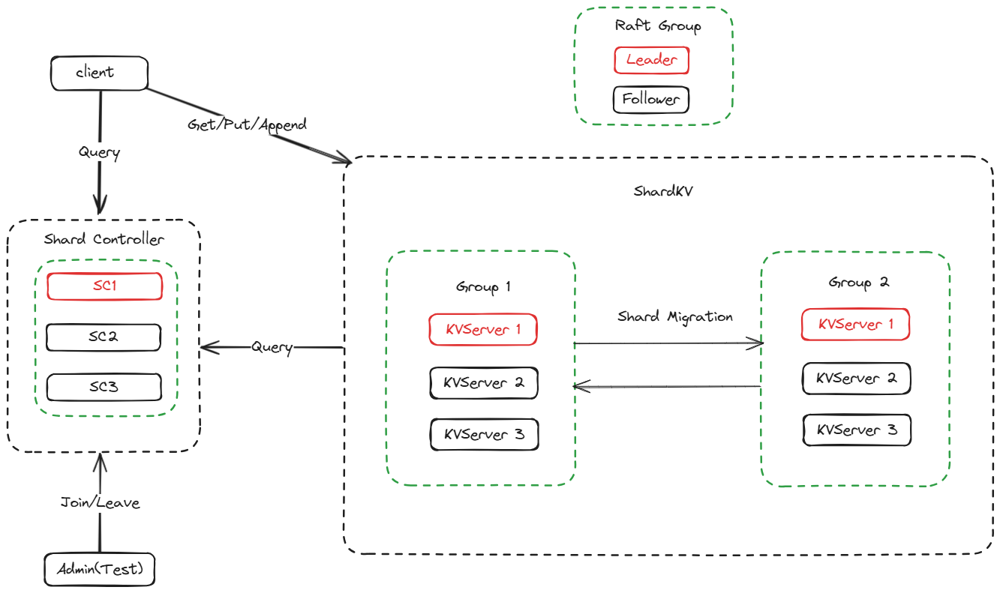

## <font style="color:rgb(0, 0, 0);">架构总览</font>

Lab5在KVRaft的基础上实现了数据的分布式存储，把全量数据分成一个个"Shard"，分别存储在不同的Group里，每个Group是一群Raft集群，这些Group里的服务器可以通过外部API实时调整他们的加入、退出。

下面这张图描述了ShardKV的架构




<font style="color:rgb(0, 0, 0);">一些补充：</font>

+ 每个Group之间唯一的通信是Shard Migration，和Raft无关，而一个Group的内部几个Server形成一个Raft集群
+ Group N里的KVServer 1是当前Group的raft leader，其余是follower。当Client请求KVServer的时候，会像KVRaft那样遍历这些KVServer，直到找到Leader
+ Config的定义如下：

```go
type Config struct {
    Num    int              // config number
    Shards [NShards]int     // shardId -> gid
    Groups map[int][]string // gid -> servers[]
}
```

+ "Shard"，是由Key唯一确定的，课程代码里给的转换方式是：

```go
func key2shard(key string) int {
	shard := 0
	if len(key) > 0 {
		shard = int(key[0])
	}
	shard %= shardctrler.NShards
	return shard
}
```

## 5A shardctrler
需要实现这几个接口：Join/Leave/Move/Query。

Join和Leave都是对一个或多个组里的Server进行了增加或者修改，controller需要根据新出现的Group或者删除的Group对所有Group分配的Shard做出管理。这里用了平均分配的办法（生产环境可以计算每个Group里的计算性能加权分配），也就是每个Group分配NShards/NGroups个Shard。

由于提供了Move接口，可能会导致已经本来配平的shards再次被破坏，所以在add或remove前需要preBalance处理，处理过程和最终的Balance处理相似：

把原来的shards数组转化为map（成为shardRev），然后用NShards/NGroups计算出每个Group需要几个Shard，然后考虑用一个队列pool，第一轮循环shardRev把每一组多余的shard回收，第二轮循环shardRev把不足的组补平，然后再把剩下的shard分给一轮循环shardRev。

因为是集群系统，需要消除循环map导致的无序性，所以写了一个双链表维护Node的顺序（类似Java里的LinkedHashMap类），称为orderedMap。

由于需要移动最少次数，所以在shard进入和退出pool的时候也需要根据实际情况定义顺序，所以也是写了一个deque（double end queue）。以及在最后把几个余数shard分配的时候要从shardRev.Keys()的逆序遍历来保证最少次数。

计M为Shard数，N为Group数，这种算法的时间复杂度是O(M+N*log(N))，主要在orderedMap的排序算法上；空间复杂度是O(M+N)。

## 5B Shard Movement && Challenges
以下的方案顺便把3个challenge也完成了，我的建议是写的时候以实现后2个challenge为目标，否则写到他们的时候可能得大改架构。

### 如何发现迁移目标
首先解决的一个问题就是当一个server发现自身shard多余或者缺失时，是push还是poll，这里我使用了push。我把Config拉取、检测自身Shard是否多余、是否缺失都用一个loop完成，这里存在一个次序问题，在一个Config完成更新之前，必须确保自身Shard没有多余，然后确保Shard没有缺失，再更新Config。

```go
func (kv *ShardKV) ConfigLoop() {
	for !kv.killed() {
		if _, isLeader := kv.rf.GetState(); !isLeader {
			loopSleep()
			continue
		}
		kv.mu.Lock()
		redundantShardIdList := make([]int, 0)
		// 检测自己是否有多余Shard，如果有就加到redundantShardIdList里
		// ...

		for _, shardId := range redundantShardIdList {
			// 把每个多余的Shard发到需要的server
		}
		if len(redundantShardIdList) > 0 {
			kv.mu.Unlock()
			loopSleep()
			continue
		}
		recv := true
		// 检测自己是否收到了所有需要的Shard
		// ...
		if !recv {
			kv.mu.Unlock()
			loopSleep()
			continue
		}
		local := kv.curConfig
		kv.mu.Unlock()
		// 确保了上述两步，才更新Config
		remote := kv.mck.Query(local.Num + 1)
        // 更新Config
        // ...
	}
}
```

用这种方法将就能保证在shard还没有完全获取或者给予完成的时候，不影响已经存在的Shard的服务，也就是后两个challenge的内容。

如何检测Shard多余/缺失？可以在Shard里加入ConfigNum字段标识，这样就可以结合curConfig和prevConfig找出它们了。

```go
type Shard struct {
	ConfigNum int
	Mp        map[string]string
	Id        int
}
// 多余
for shardId, gid := range kv.prevConfig.Shards {
    if gid == kv.gid && kv.curConfig.Shards[shardId] != gid && kv.shardMap[shardId].ConfigNum < kv.curConfig.Num {
        redundantShardIdList = append(redundantShardIdList, shardId)
    }
}
// 缺失
recv := true
for sid, gid := range kv.prevConfig.Shards {
    if gid != kv.gid && kv.curConfig.Shards[sid] == kv.gid && kv.shardMap[sid].ConfigNum < kv.curConfig.Num {
        recv = false
    }
}
```

相应地在添加Shard的时候，需要填入对应的ConfigNum。

### 如何迁移Shard
得到了redundantShardIdList后，就可以向相应的server发送shard了。需要发送以下内容：

```go
type PushShardArgs struct {
	Shard     Shard
	ConfigNum int
	SeqMap    map[int64]int
	ClientGid int
}
```

比较特别的是SeqMap，因为很有可能在config change的时候某个client从请求server A变成了请求server B，那么就会产生重复请求问题。所以server B需要找到自己的SeqMap和server A发送过来的SeqMap之间的差集，把增量部分加到自己的SeqMap里。

另外ConfigNum也必不可少，接收端比较自己的ConfigNum发现接受的ConfigNum更大的时候，说明还没准备好；如果更小则说明发送端过时，这两种情况都需要返回错误，让发送端继续发送或者放弃发送。

由于需要把Shard同步到Raft集群里，Leader收到请求后要向Raft层转递这个信息，然后在applier端完成最后的插入操作。

applier的代码：

```go
info := cmd.Command.(PushShardInfo)
shard := info.Shard
if kv.curConfig.Num < cmd.ConfigNum {
    res.Err = ErrNotReady
} else if shard.ConfigNum < kv.curConfig.Num {
    res.Err = ErrConfigStale
} else if kv.shardMap[info.Shard.Id].Mp != nil {
    // already received, do nothing
} else {
    kv.shardMap[shard.Id] = shard.Clone(shard.ConfigNum)
    for cid, rid := range info.SeqMap {
        if rid0, ok := kv.seqMap[cid]; !ok || rid0 < rid {
            kv.seqMap[cid] = rid
        }
    }
}
```

### 如何更新Config
在上述ConfigLoop的最后，leader给raft层传递一个更新Config的消息即可。注意applier的时候初始化Shard。

### 如何Garbage Collect
在ConfigLoop里生成的push协程发现返回结果是OK的话，就向raft层传递一个Garbage Collect的消息。

### Snapshot
仅需要持久化这几个变量：

```go
func (kv *ShardKV) takeSnapshot(lastIndex int) {
	w := new(bytes.Buffer)
	e := labgob.NewEncoder(w)
	e.Encode(kv.shardMap)
	e.Encode(kv.seqMap)
	e.Encode(kv.curConfig)
	e.Encode(kv.prevConfig)
	kv.rf.Snapshot(lastIndex, w.Bytes())
}
```

lastIndex是applier层收到的msg的index

### Timing is Everything
仔细阅读Test代码会发现，一些Test会在对Config乱改一通之后sleep一段时间，然后直接把用不到的Group给kill掉，接着再去check。于是如果这期间shard migration没有完成的话就会一直not ready，永远没法完成测试。这一开始给我造成了很大困惑，最后还是通过微调timing通过了所有测试。我最终把raft层等待时间设为2000ms，config_loop时间设置为300ms。

