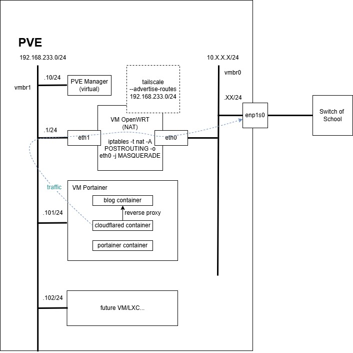
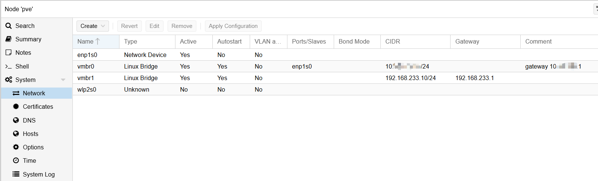
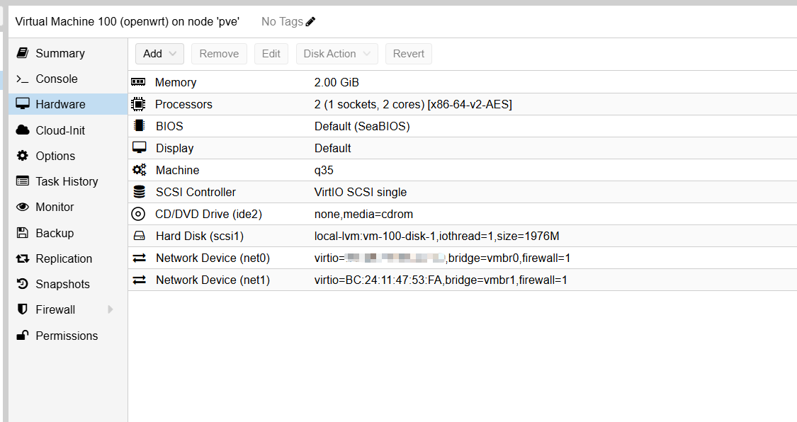
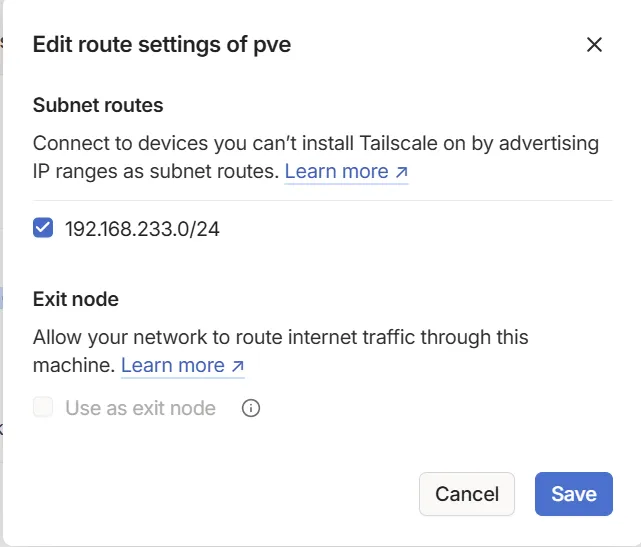
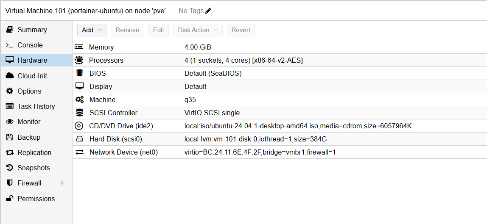

注：本篇主要讲述网络配置，PVE装机等细节懒得写了（

废话：时隔一万年后一个叫bridge的fw终于想起了他的博客，决定更新。原来用的博客是xlog，但是发现主页文章卡片飘忽不定。github上有[很多类似的issues](https://github.com/Crossbell-Box/xLog/issues/2173)(文章末尾有反转)。正值mac-mini发售之际，周围朋友对小主机的热情似乎提高了起来。bridge看着脚下吃灰的小主机，决定用它配一个PVE用来跑博客。

但是接入学校的有线网有个问题：接入的交换机有一个IP-MAC表，需要申请登记，否则不在表里会被拦截。所以Plan A：所有虚拟机全部桥接，每开一个虚拟机都找管理员登记一遍。为了防止管理员说"how old are you"，就有了Plan B。

于是为了这个博客，bridge包了这样一盘饺子：

# 网络拓扑图


OpenWRT作为软路由，用SNAT给PVE里的虚拟机开了一个内网，这样在出网的时候都用的是OpenWRT的IP-MAC。内网设备通过PVE的vmbr1桥接网络连在一起，而vmbr0连接了OpenWRT和物理网卡。

怎么从外部管理内部虚拟机？这里我在OpenWRT上装了一个tailscale，开启子网转发。

博客怎么弄到公网？我使用了cloudflare的TUN，它相当于一个反向代理，可以直接把`blog.queenbridge.tech`转发到探针（cloudflared container）上，然后探针向内网请求再发给公网。

# 搭建过程&&一些坑
## PVE
最原始的情况下，我们只有一个PVE，如果按照最终的拓扑我的laptop根本没办法连上管理端口。所以在OpenWRT配置完成之前有两种办法：

+ 把laptop和PVE都连到交换机上，PVE和laptop的有线口网关设成校园网的网关
+ 干脆把直接laptop和PVE用一根网线连起来

首先给PVE添加两个桥接网络，vmbr0桥接到物理有线网卡enp1s0上用于通过交换机连校园网，vmbr1用作内网广播域。



登录PVE，最终/etc/network/interfaces的配置如下

```powershell
auto lo
iface lo inet loopback

iface enp1s0 inet manual

iface wlp2s0 inet manual

auto vmbr0
iface vmbr0 inet static
        address 10.X.X.X/24  # 校园网IP
        bridge-ports enp1s0
        bridge-stp off
        bridge-fd 0
auto vmbr1

iface vmbr1 inet static
        address 192.168.233.10/24
        gateway 192.168.233.1
        bridge_ports none
        bridge_stp off
        bridge_fd 0


source /etc/network/interfaces.d/*
```

立即使用配置：

`systemctl restart networking`

# OpenWRT
我是硬件苦手，用的是一个年久失修但是功能齐全的版本

[github.com/SuLingGG/OpenWrt-Rpi](https://github.com/SuLingGG/OpenWrt-Rpi)

我已经记不清楚这个固件是否默认配置了NAT，总之最终需要实现SNAT

`iptables -t nat -A POSTROUTING -o eth0 -j MASQUERADE`

的等效命令。这条命令把所有通过eth0出网的包的IP改为OpenWRT的IP。

给OpenWRT添加两块虚拟网卡，分别桥接到vmbr0和vmbr1。



我是通过修改/etc/config/network设置的。我新建了本机的桥接网络称为br-lan，也就是内网广播域，然后LAN口桥接到这上面，而WAN口直通PVE对应物理网卡的桥接网络下的虚拟网卡eth0。

```powershell
config interface 'loopback'
        option ifname 'lo'
        option proto 'static'
        option ipaddr '127.0.0.1'
        option netmask '255.0.0.0'

config globals 'globals'
        option packet_steering '1'

config device
        option name 'br-lan'
        option type 'bridge'
        list ports 'eth1'

config interface 'lan'
        option device 'br-lan'
        option proto 'static'
        option ipaddr '192.168.233.1'
        option netmask '255.255.255.0'
        option ip6assign '60'

config interface 'wan'
        option ifname 'eth0'
        option proto 'static'
        option ipaddr '10.X.X.X' # 校园网IP
        option netmask '255.255.255.0'
        option gateway '10.X.X.1' # 校园网网关
        option dns '1.1.1.1'

config interface 'wan6'
        option ifname 'eth0'
        option proto 'dhcpv6'

config interface 'vpn0'
        option ifname 'tun0'
        option proto 'none'
```

设置好之后执行/etc/init.d/network restart

当然也可以通过uci，或者直接在WebUI里设置NAT。

修改防火墙策略，允许WAN口下行流量

`vim /etc/config/firewall`

```
config zone
        option name 'wan'
        list network 'wan'
        list network 'wan6'
        option input 'ACCEPT'
        option output 'ACCEPT'
        option forward 'REJECT'
        option masq '1'
        option mtu_fix '1'
```

重启防火墙

```
/etc/init.d/firewall restart
```

tailscale的配置我参考了[OpenWrt安装配置Tailscale实现内网穿透，异地组网 – 老胡的博客](https://iqotom.com/?p=1873)这篇博客。此过程可能需要科学上网。

> 1、下载软件
>
> 将Tailscale软件包下载到指定目录。单击这里，找到最新的软件包，下载到本地。然后使用Winscp工具将下载的软件上传到OpenWrt的/tmp目录下，也可以找到下载链接，直接使用wget命令下载。
>
> wget https://github.com/adyanth/openwrt-tailscale-enabler/releases/download/v1.36.1-fb2f6cf-autoupdate/openwrt-tailscale-enabler-v1.36.1-fb2f6cf-autoupdate.tgz
>
> 2、解压缩软件
>
> tar x -zvC / -f openwrt-tailscale-enabler-v1.36.1-fb2f6cf-autoupdate.tgz
>
> 3、安装依赖包
>
> opkg update
>
> opkg install libustream-openssl ca-bundle kmod-tun
>
> 4、设置开机启动，验证开机启动
>
> /etc/init.d/tailscale enable
>
> ls /etc/rc.d/S*tailscale*
>
> 5、启动tailscale
>
> /etc/init.d/tailscale start
>
> 6、获取登录链接，配置路由
>
> tailscale up
>
> 复制显示的地址，并在浏览器中打开，使用谷歌或微软帐号登录Tailscale的管理主页进行验证。
>
> 7、开启子网网路由
>
> 在OpenWrt上输入以下命令，打开本地子路由。子网地址是OpenWrt的lan网络。
>
> tailscale up --accept-routes --accept-dns=false --advertise-routes=192.168.100.0/24 
>
> --netfilter-mode=off 关闭自动添加防火墙功能，因为该功能会影响新版本的防火墙配置。
>
> --accept-dns=false 关闭接受 dns 通告，不接受服务器的dns。
>
> --accept-routes接受其他子网路由器以及作为子网路由器的任何其他节点的通告路由。
>
> --advertisse-routes 将物理子网路由公开到整个 Tailscale 网络。
>
> 在Tailscale的管理页面上，单击设备列表右侧的更多图标，禁用密钥过期，并打开子网路由。
>

切记在tailscale管理上通过子网路由的申请



## Portainer VM
portainer VM给一个vmbr1的网卡即可



安装docker后，portainer container直接拉取官方镜像即可，不用做任何配置。

一开始我在VM里装cloudflared，但是概率性连不上，换成官方container神奇地就连上了。

## Blog
blog是portainer vm里的一个容器。博客用到的是之前魔改版的[gokarna](https://github.com/526avijitgupta/gokarna)主题hugo。

写了一个docker container，caddy:alpine镜像，装了个openssh，这样后续可以用scp完成部署。

```dockerfile
FROM caddy:alpine
COPY public/ /usr/share/caddy
RUN apk update && apk add openssh && apk cache clean
RUN ssh-keygen -A
RUN mkdir /root/.ssh
COPY blog.pub /root/.ssh/authorized_keys
COPY sshd_config /etc/ssh/sshd_config
EXPOSE 80 22
CMD /usr/sbin/sshd && caddy run --config /etc/caddy/Caddyfile --adapter caddyfile
```

注意sshd_config里设置了允许公钥和允许root。

目前的上传方案不太优雅，之后可能会折腾一下github action。

从我的laptop把Hugo生成的静态文件使用scp部署到blog container的完整命令：

`scp -r -P 10002 -i C:/Users/KingB/.ssh/blog -o "ProxyCommand ssh -W %h:%p -i C:/Users/KingB/.ssh/ser-portainer portainer@192.168.233.101" D:/document/hugo_service/real-hugo-blog/public/. root@127.0.0.1:/usr/share/caddy`

别急，我自己也头晕。大致原理是在portainer开了个SSH远程转发。

# 反转了
搞完这一大堆，我发现xlog神奇地能用了，我猜是区块链长度原因。这有种诺门坎战役里大阪师团的美感。。。

> 1939年，苏联跟日本于中蒙边界诺门坎地区爆发战争，关东军令驻扎于北部的大阪跟仙台两师团紧急动员，前去增援。接到命令以后，仙台师团强行军四天自海拉尔赶往诺门坎，抵达战场的当天便投入战斗中。
>
> 跟仙台师团不同，出动命令下达后，第四师团则是迟迟不动。师团中的疾病患者突然激增了，放眼望去，满营都是表示生病而需要留守的官兵。因此，日军联队长亲自坐镇医务室参加诊断，才勉强组织好部队向前线进发，“联队长改行当大夫”也就此流传开来。从海拉尔走到诺门坎，第二师团用了四天，而第四师团则是用了八天，更是有大量人员掉队。在第四师团先遣队抵达前线的当天，苏日宣布停战。掉队的第四师团官兵就如同吃了兴奋剂一般跟了上来，留守的官兵也有不少“带病”赶至前线，还十分懊丧地表示他们竟然没能有机会打上一仗。
>
> 而且在返程的时候，齐装满员且精神饱满的第四师团成为日军当中最威武的部队，率先赶到战场的第二师团则丢盔卸甲、伤兵满营。关东军负责新闻宣传的军官还提起笔将日军报纸呈上审查的《我无敌皇军第四师团威势归来》新闻标题改了一个字，变成了《我无伤皇军第四师团威势归来》，拐弯抹角地嘲讽了这支“软蛋”部队。
>

所以现在我有三个博客，也算是实现[拟态防御系统](https://baike.baidu.com/item/%E6%8B%9F%E6%80%81%E9%98%B2%E5%BE%A1/18923241)了。

[https://blog.queenbridge.tech/](https://blog.queenbridge.tech/)

[https://kingbridge.xlog.app/](https://kingbridge.xlog.app/)

[https://www.cnblogs.com/kingbridge](https://www.cnblogs.com/kingbridge)

最后感谢计网带师[fdt](https://github.com/FredericDT)的指导orz