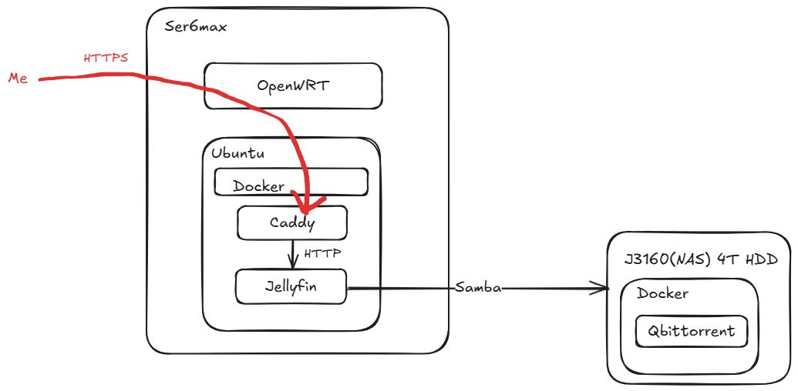

最近沉迷二次元，正好捡垃圾搞到一台J3160工控机，以此作为挂载磁盘简单搞了一套“家庭”影院。

需求：PT、多设备观看、加密

设备：零刻SER6 MAX、J3160工控机、4T HDD硬盘


# 框架
影院软件使用Jellyfin，PT使用Qbittorrent，二者都需要Docker容器化。

实测J3160跑Jellyfin在烧录字幕时巨卡（拖动进度条基本10s起步），考虑仅仅把J3160作为网络存储，而用ser6max跑Jellyfin解析视频。（无端联想东数西算）

Ser6Max的OpenWRT当时刷机的时候忘记搞IPV6支持，索性直接在J3160上挂PT了（PT需要开启IPV6）。

毕竟是校园网而不是真家庭的内网，需要HTTPS加密一下。这里使用Caddy简单反代一下自签名HTTPS。（当然如果用tailscale可以直接端到端加密，好用爱用）



# 操作系统
Ser6Max的架构见[在校园网通过PVE+OpenWRT NAT接入有线网](/posts/2024_fall/pveandnat/)

J3160使用Ubuntu 24

# Samba
smb协议支持加密，并且能适配多系统。

## Linux服务端
J3160上启用Samba服务

`sudo vim /etc/samba/smb.conf`

末尾添加

```plain
[NetShare]
   comment = Single User Share
   path = /mnt/data0/net
   browseable = yes
   writable = yes
   valid users = [user]
   create mask = 0644
   directory mask = 0755
```

```bash
sudo chown -R [user] /mnt/data0/net 
sudo smbpasswd -[user] password
sudo systemctl restart smbd
```

## Linux客户端
`sudo vim /etc/cifs-credentials`

```plain
username=[smbuser]
password=[smbpassword]
```

`sudo vim /etc/fstab`

```bash
# 末尾添加
//[ip]/NetShare /mnt/nas cifs credentials=/etc/cifs-credentials,uid=[客户端用户名] 0 0
```

启用挂载：

```bash
sudo apt install cifs-utils
sudo mount /mnt/nas
```

## Windows客户端
直接文件浏览器输入`\\[ip]`即可。此时使用PotPlayer即可直接播放视频。

## VLC
VLC是多端视频播放器，支持包括SMB在内的很多远程协议。此时通过VLC连接上面的smb地址已经可以做到流畅播放视频了，解码工作在客户端本地完成。后面Jellyfin则是把解码工作转移到服务器上。

# Jellyfin
用Docker启动

```bash
docker run -d \
 --name jellyfin \
 --volume /home/portainer/jellyfin/config:/config \
 --volume /home/portainer/jellyfin/cache:/cache \
 --mount type=bind,source=/mnt/nas/videos,target=/media \
 -p 8096:8096 \
 jellyfin/jellyfin
```

## 字幕问题
字幕和视频同名即可出现CC字幕选项（PotPlayer和VLC也是一样），例如

```bash
S01E01.mkv
S01E01.ass
```

Jellyfin对中日韩字幕可能会出现乱码（白框），可以在Jellyfin服务端安装字幕。

首先找一个好看的字体，我使用的是Noto Serif Simplified Chinese

接下来有两种方法：

1. 设置备用字幕

Dashboard - Playback - Transcoding - Fallback font

此方法实测只支持小部分字体

2. 强制烧录

Jellyfin可能会不加载字幕，可以通过左上角-settings-subtitles强制烧录所有字幕。这种方法Jellyfin会从系统字体里找字体，可以考虑软连接到容器的/config/fonts到容器的系统字体

容器内执行：

`mkdir /usr/share/fonts/custom && ln -s /config/fonts/ /usr/share/fonts/custom`

## 削刮
Jellyfin的削刮器意思是根据媒体信息在网上爬一些元数据，例如封面、评分等。个人觉得没必要，并且打开之后导入视频速度显著变慢。

关闭的方法是导入的时候注意那几个爬取选项全部取消勾选即可。

# Qbittorrent
这里宿主机的IPV6是手动配置的，netplan如下

```plain
a@a-AIO:/mnt/data0/net$ sudo cat /etc/netplan/xxx.yaml
network:
  version: 2
  ethernets:
    NM-xxx:
      renderer: NetworkManager
      match:
        name: "enp3s0"
      addresses:
      - "10.xxx/24"
      - "2001:xxxx:xxxx:xxxx::xxxx:1/64"
      nameservers:
        addresses:
        - 114.114.114.114
        - 1.1.1.1
        - 2400:3200::1
        - 2400:3200:baba::1
      wakeonlan: true
      networkmanager:
        uuid: "xxxx"
        name: "有线连接 1"
        passthrough:
          connection.autoconnect-priority: "-999"
          ethernet._: ""
          ipv4.address1: "xxx/24,xxx.1"
          ipv4.method: "manual"
          ipv6.addr-gen-mode: "default"
          ipv6.address1: "2001:xxxx:xxxx:xxxx::xxxx:1/64,2001:xxxx:xxxx:xxxx::1"
          ipv6.method: "manual"
          ipv6.ip6-privacy: "-1"
          proxy._: ""
```

`sudo netplan apply`

然后Docker使用Host模式直接使用宿主机的ipv6。Qbittorrent的WebUI镜像可以去

https://github.com/qbittorrent/qBittorrent/wiki/List-of-known-alternate-WebUIs

这里找。

我使用了VueTorrent

```bash
docker run \
    --name qbittorrent \
    -e PUID=1000 \
    -e PGID=1000 \
    -e UMASK=002 \
    -e TZ="Asia/Shanghai" \
    -e WEBUI_PORTS="8080/tcp,8080/udp" \
    -v /home/a/qbittorrent/config:/config  \
    -v /mnt/data0/net/:/downloads  \
    --network host \
  	-d \
    ghcr.io/hotio/qbittorrent
```

容器内验证ipv6：

`curl -6 ifconfig.co`

启动后去settings - WebUI里设置UI路径为/app/vuetorrent即可使用这个UI。

# Caddy
生成自签名证书

`openssl req -x509 -newkey rsa:4096 -keyout key.pem -out cert.pem -days 36500 -nodes -subj "/CN=localhost"`

Caddyfile

```bash
{
    auto_https off
}

:8097 {
    tls /app/certs/cert.pem /app/certs/key.pem
    reverse_proxy http://host.docker.internal:8096
}
```

```bash
docker run -d \
	-p 8097:8097 \
	-v $(pwd)/Caddyfile:/etc/caddy/Caddyfile \
	-v $(pwd):/app/certs \
	--add-host=host.docker.internal:host-gateway \
	caddy:alpine
```

